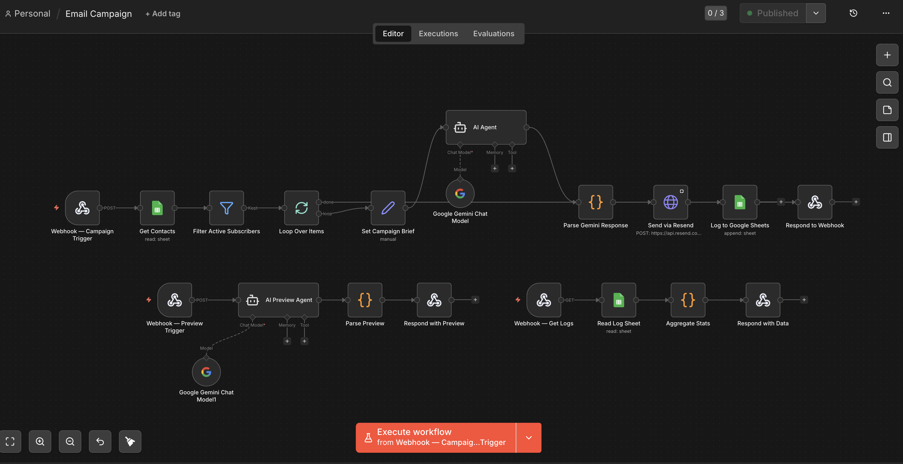

# 🚀 AI-Powered Marketing Automation System

## 🚀 Overview
MailFlow AI is an end-to-end email marketing automation system that leverages AI agents to generate, personalize, and send campaigns automatically.
Users simply input a campaign brief, and the system handles the entire workflow — from content generation to delivery and analytics tracking.

## 🎯 Problem
Creating email campaigns manually is slow, repetitive, and requires both marketing and technical effort.
Businesses struggle to:
- Write high-converting emails
- Personalize content at scale
- Manage campaign workflows
- Track performance in real-time

## 💡 Solution
I designed and built an automated pipeline that:
- Generates marketing content using AI
- Users approve campaigns via UI
- Sends personalized email campaigns automatically
- Logs campaign activity for tracking and analysis

## 🧱 Tech Stack

- **Workflow Automation:** n8n  
- **Programming:** JavaScript  
- **AI / LLM:** Google Gemini, ChatGPT, Groq, Claude
- **APIs:** Gmail API, Google Sheets API  
- **Data Layer:** Google Sheets  

## ✨ Key Features
- ✨ AI-generated email campaigns (subject + HTML content)
- 👀 Campaign preview before sending
- 📤 Automated email delivery via Resend API
- 🖼 Image support (user-uploaded or dynamic)
- 📊 Real-time analytics dashboard
- 📜 Campaign activity logs
- ⚡ Fully automated workflow using n8n

## 🧪 Demo

### 🔹 Workflow Automation

### 🔹 Email Output

## 📈 Impact
- Reduced manual marketing effort  
- Improved campaign efficiency and consistency  
- Enabled scalable, automated customer engagement  

## 🧠 Key Takeaways
- Built a real-world automation system integrating multiple APIs  
- Designed an end-to-end pipeline from data → AI → delivery  
- Applied LLMs to solve business problems (not just experiments)  
