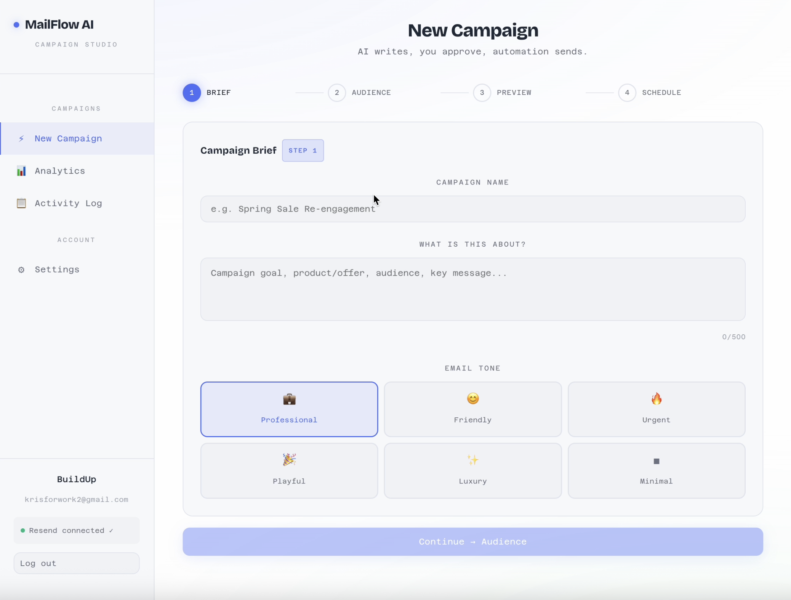
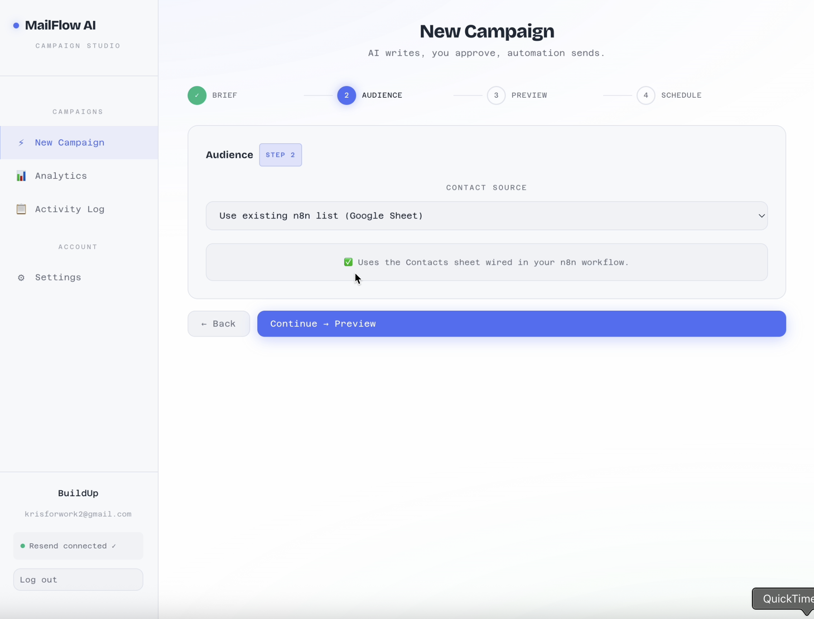
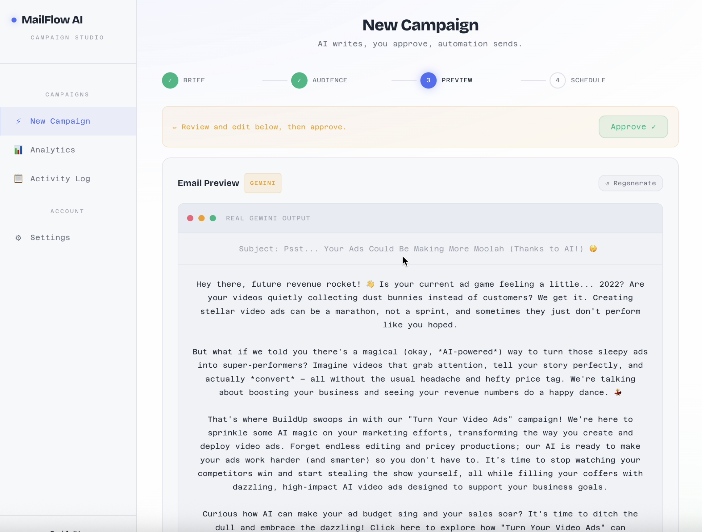
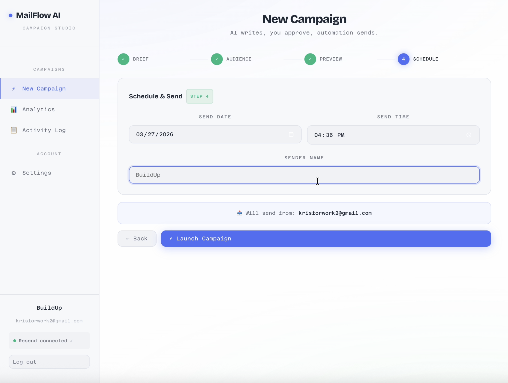
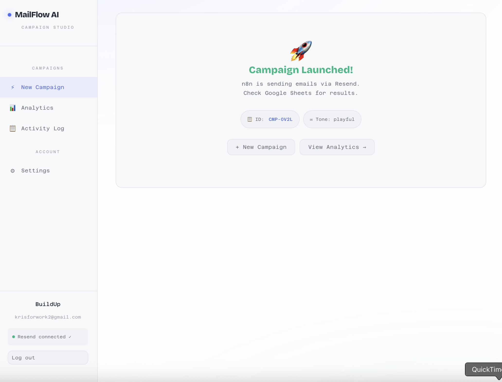

# 🚀 AI-Powered Marketing Automation System

## 🚀 Overview
MailFlow AI is an end-to-end email marketing automation system that leverages AI agents to generate, personalize, and deliver campaigns automatically.
Users simply input a campaign brief, and the system handles the entire workflow — from content generation to email delivery and analytics tracking.

## 🎯 Problem
Creating email campaigns manually is slow, repetitive, and requires both marketing and technical effort.
Businesses struggle to:
- Write high-converting emails
- Personalize content at scale
- Manage campaign workflows
- Track performance in real-time

## 💡 Solution
I designed and built an automated pipeline that:
- Generates marketing content using AI
- Users approve campaigns via UI
- Sends personalized email campaigns automatically
- Logs campaign activity for tracking and analysis

## 🧱 Tech Stack
- **Frontend:** React.js
- **Workflow Automation:** n8n  
- **Programming:** JavaScript  
- **AI / LLM:** Google Gemini, ChatGPT, Groq, Claude
- **APIs:** Gmail API, Google Sheets API, Resend API  
- **Database / Storage:** Google Sheets*Data Layer:** Google Sheets  

## 🧪 Demo
### 🔹 Workflow Automation

### 🔹 Email Output

## 📈 Impact
- Reduced manual marketing effort  
- Improved campaign efficiency and consistency  
- Enabled scalable, automated customer engagement  

## 🧠 Key Feature
- AI-generated email campaigns
- End-to-end automation using n8n
- Personalized content per user
- Real-time analytics tracking
- Preview before sending
- API-based architecture

## 🙌 Author
Kris Huynh
**Focus:** Data Analytics, AI, Automation
