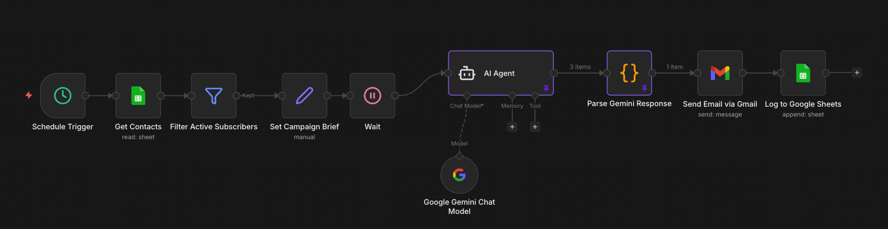
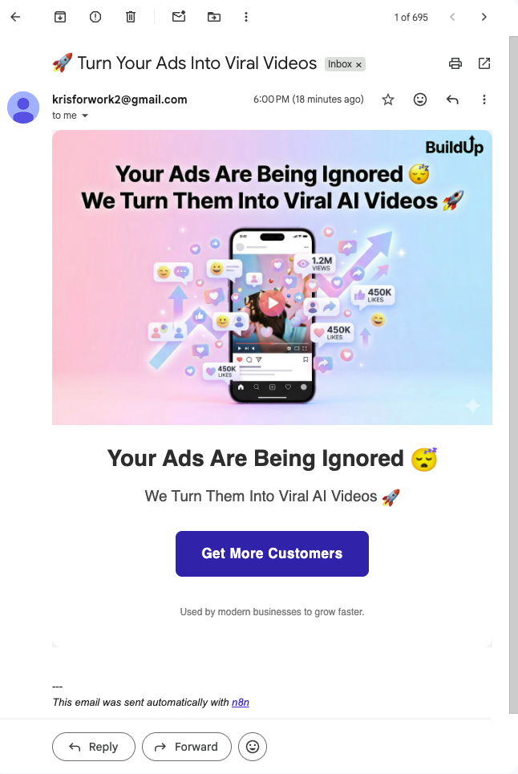

# 🚀 AI-Powered Marketing Automation System

## 📌 Overview
This project is an end-to-end AI-driven marketing automation system that generates campaign content and automatically sends emails to customers.

It integrates workflow orchestration, large language models (LLMs), and API-based services to automate marketing operations at scale.

## 🎯 Problem
Many businesses struggle with:
- Manual and time-consuming campaign creation
- Inconsistent marketing content
- Inefficient customer outreach workflows

## 💡 Solution
I designed and built an automated pipeline that:
- Generates marketing content using AI (Google Gemini)
- Sends personalized email campaigns automatically
- Logs campaign activity for tracking and analysis

## ⚙️ Architecture

### Pipeline Flow:
1. Schedule Trigger → Initiates campaign workflow  
2. Get Contacts → Retrieves customer data from Google Sheets  
3. Filter Active Subscribers → Filters valid users  
4. Campaign Brief → Defines campaign content input  
5. AI Agent (Gemini) → Generates marketing copy  
6. Parse Response → Formats AI output  
7. Send Email → Sends emails via Gmail API  
8. Log Results → Stores campaign logs in Google Sheets  

## 🧱 Tech Stack

- **Workflow Automation:** n8n  
- **Programming:** JavaScript  
- **AI / LLM:** Google Gemini API  
- **APIs:** Gmail API, Google Sheets API  
- **Data Layer:** Google Sheets  

## ✨ Key Features

- 🤖 AI-generated marketing content  
- 📧 Automated email campaign delivery  
- 🔄 End-to-end workflow orchestration  
- 📊 Campaign logging and tracking  
- ⚡ Scalable marketing automation pipeline  

## 🧪 Demo

### 🔹 Workflow Automation

### 🔹 Email Output

## 📈 Impact

- Reduced manual marketing effort  
- Improved campaign efficiency and consistency  
- Enabled scalable, automated customer engagement  

## 🧠 Key Takeaways

- Built a real-world automation system integrating multiple APIs  
- Designed an end-to-end pipeline from data → AI → delivery  
- Applied LLMs to solve business problems (not just experiments)  
